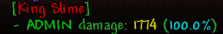

# BossKillInfo Plugin

BossKillInfo is a TShock plugin for Terraria that displays a message with boss kill information and the players who contributed to the boss's defeat.

## Features

- Tracks damage dealt to bosses by each player.
- Displays a message with the boss's name, each player's damage, and their contribution percentage when a boss is killed.

## Installation

1. Download the plugin DLL file.
2. Place the DLL file in the `ServerPlugins` folder of your TShock server.
3. Restart your server.

## Usage

The plugin automatically tracks boss fights and displays the information when a boss is killed. No additional configuration is required.

## Example

When a boss is killed, a message like the following will be displayed:

```
[BossName]
- Player1 damage: 5000 (50.0%)
- Player2 damage: 3000 (30.0%)
- Player3 damage: 2000 (20.0%)
```

## Preview


## License

This project is licensed under the [MIT](./LICENSE) License.
